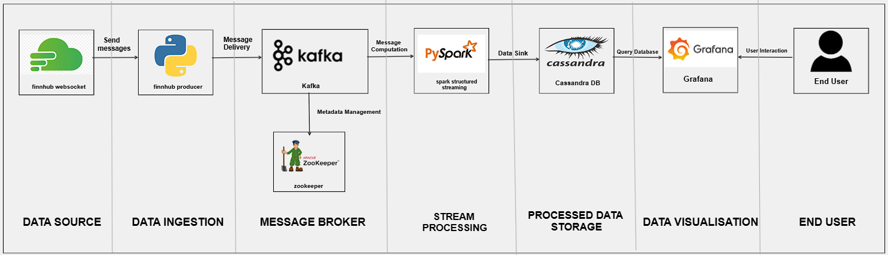
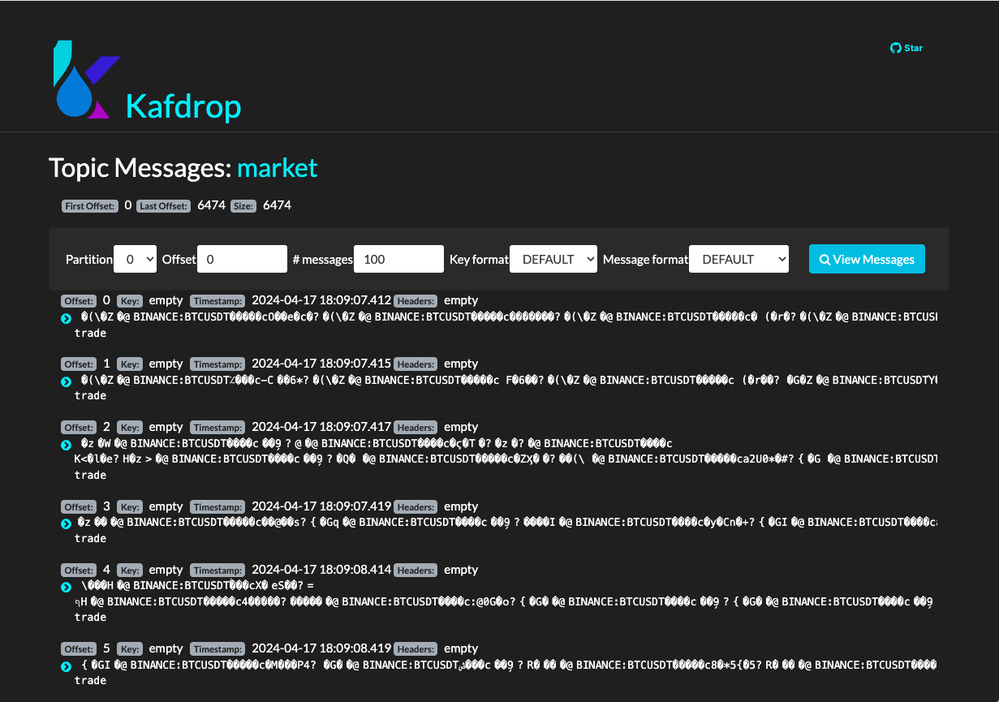

////
NO CAMBIAR!!
Codificación, idioma, tabla de contenidos, tipo de documento
////
:encoding: utf-8
:lang: es
:toc: right
:toc-title: Tabla de contenidos
:doctype: book
:linkattrs:

////
Nombre y título del trabajo
////
= Desarrollo de un cuadro de mandos para Finnhub Stock
Máster en Tecnologías y Aplicaciones en Ingeniería Informática. Universidad de Almería -
José Antonio Martínez <jmartine@ual.es> y Manuel Torres <mtorres@ual.es>

image::images/di.png[]

// NO CAMBIAR!! (Entrar en modo no numerado de apartados)
:numbered!: 

[abstract]
== Resumen
////
COLOCA A CONTINUACION EL RESUMEN
////
Finnhub Stock es una API que proporciona datos de acciones en tiempo real, noticias financieras y más. Es una herramienta útil para desarrolladores que desean crear aplicaciones financieras o realizar análisis de datos. En este tutorial vamos a ver cómo crear una plataforma alrededor de la API de Finnhub Stock. La plataforma ofrecerá un cuadro de mandos con información en tiempo real sobre las acciones bursátiles de una empresa. Los datos obtenidos de la API de Finnhub Stock se enviarán a un servidor Kafka para su procesamiento posterior mediante Spark Streaming. Los datos procesados se almacenarán en una base de datos Cassandra para su consulta y visualización en un cuadro de mandos en Grafana. Con estos componentes, podremos crear una plataforma completa para visualizar los precios en tiempo real de las acciones de una empresa. La plataforma nos permitirá realizar análisis de datos sobre las acciones y tomar decisiones informadas sobre inversiones financieras. La plataforma se instalará en un entorno de pruebas con Docker y se ejecutará sobre una máquina virtual OpenStack, la cual crearemos con Terraform.
////
COLOCA A CONTINUACION LOS OBJETIVOS
////
.Objetivos
* Aprender a utilizar la API de Finnhub Stock para obtener datos de acciones en tiempo real.
* Desarrollar una plataforma de data streaming y visualización de Finnhub Stock con Apache Kafka, Apache Spark, Cassandra y Grafana.
* Crear un cuadro de mandos interactivo con Grafana para visualizar los precios en tiempo real de las acciones de una empresa.
* Destacar la importancia de la infraestructura como código (IaC) para despliegues automatizados.

[TIP]
====
Disponibles en GitHub los siguientes repositorios:

* https://github.com/ualmtorres/finnhub-data-streaming-terraform[Repositorio de creación de la máquina virtual OpenStack con Terraform]
* https://github.com/ualmtorres/finnhub-data-streaming-docker-compose[Repositorio de la plataforma de data streaming y visualización con Docker]
* https://github.com/ualmtorres/finnhub-data-streaming-workload-simulator[Repositorio de los productores, consumidores y procesadores de datos de Finnhub Stock]
====

// NO CAMBIAR!! (Entrar en modo numerado de apartados)
:numbered: 

== Introducción

https://finnhub.io/[Finnhub Stock] es una API que proporciona datos de acciones en tiempo real, noticias financieras y más. Es una herramienta útil para desarrolladores que desean crear aplicaciones financieras o realizar análisis de datos. Actualmente, Finnhub Stock ofrece una API gratuita con una amplia gama de funcionalidades. Entre estas funcionalidades se incluyen la obtención de precios en tiempo real, datos históricos, información sobre empresas y más. Algunas de estas funcionalidades están disponibles en el plan gratuito, mientras que otras requieren una suscripción de pago. Los servicios están disponibles como API REST y Websocket, lo que permite a los desarrolladores elegir la forma de acceder a los datos. La API de Finnhub Stock es fácil de usar y proporciona una gran cantidad de datos para ayudarte a desarrollar tus aplicaciones financieras.

En este tutorial vamos a ver cómo crear una plataforma alrededor de la API de Finnhub Stock. La plataforma creada ofrecerá un cuadro de mandos con información en tiempo real sobre las acciones de una empresa. Para ello, desarrollaremos los siguientes componentes:

* Un componente para consumir de la API de Finnhub Stock y obtener los datos de las acciones de una empresa. Este componente realizará solicitudes Websocket a la API para obtener los precios en tiempo real de las acciones. Los datos serán enviados a un servidor Kafka para su procesamiento posterior. Este componente actuará como _productor_ de datos a la plataforma.

* Un componente Spark Streaming para procesar los datos de las acciones en tiempo real. Este componente leerá los datos del servidor Kafka y realizará cálculos sobre los precios de las acciones.

* Una base de datos para almacenar los datos procesados por el componente Spark Streaming. Utilizaremos una base de datos NoSQL como Cassandra para almacenar los datos de las acciones. Los datos se almacenarán en tablas que permitan realizar consultas eficientes sobre los precios de las acciones. Esta base de datos será el repositorio de datos de la plataforma.

* Un cuadro de mandos en Grafana para visualizar los datos de las acciones de una empresa. Utilizaremos Grafana para crear gráficos interactivos que muestren los precios en tiempo real de las acciones. Los gráficos se actualizarán automáticamente a medida que se reciban nuevos datos de la API de Finnhub Stock.

La figura siguiente muestra la arquitectura de la plataforma que vamos a desarrollar.

Con estos componentes, podremos crear una plataforma completa para visualizar los precios en tiempo real de las acciones de una empresa. La plataforma nos permitirá realizar análisis de datos sobre las acciones y tomar decisiones informadas sobre inversiones financieras.

La figura siguiente muestra un ejemplo del cuadro de mandos que vamos a crear con Grafana. En el cuadro de mandos, podremos ver los precios en tiempo real de las acciones de una empresa. Los gráficos se actualizarán automáticamente a medida que se reciban nuevos datos de la API de Finnhub Stock y se procesen en la plataforma.

image::images/dashboard.png[Cuadro de mandos de Grafana]

== Configuración de la plataforma

Para configurar la plataforma, necesitaremos instalar y configurar los siguientes componentes:

* Apache Kafka: Utilizaremos https://kafka.apache.org/[Apache Kafka] como servidor de mensajería para guardar los datos recibidos de la API de Finnhub Stock y enviar los datos de las acciones al componente Spark Streaming.

* Apache Spark: Utilizaremos https://spark.apache.org/[Apache Spark] para procesar los datos de las acciones en tiempo real y realizar cálculos sobre los precios de las acciones.

* Apache Cassandra: Utilizaremos https://cassandra.apache.org/_/index.html[Apache Cassandra] como base de datos NoSQL para almacenar los datos de las acciones procesados por el componente Spark Streaming.

* Grafana: Utilizaremos https://grafana.com/[Grafana] para crear un cuadro de mandos interactivo que muestre los precios en tiempo real de las acciones de una empresa.

En los siguientes pasos, veremos cómo instalar y configurar cada uno de estos componentes en nuestra plataforma.

[NOTE]
====
Los scripts del tutorial para producir, consumir y procesar datos están programdos en Python.
====

Esta plataforma se instalará en un entorno de pruebas con Docker. Dicha plataforma se ejecutará sobre una máquina virtual en un cloud OpenStack, la cual crearemos con Infraestructura como Código (IaC) con Terraform.

=== Creación de la máquina virtual OpenStack con Terraform

https://www.terraform.io/[Terraform] es una herramienta de código abierto que permite definir y configurar la infraestructura mediante programación, con código. Con Terraform, podemos definir nuestra infraestructura como código y desplegarla de forma automatizada. Para más información sobre Terraform, puedes consultar este https://ualmtorres.github.io/SeminarioTerraform/[tutorial sobre despliegue de infraestructura con Terraform].

[NOTE]
====
Para instalar Terraform, puedes seguir las instrucciones de la https://learn.hashicorp.com/tutorials/terraform/install-cli[documentación oficial de Terraform].
====

En este caso, vamos a utilizar Terraform para crear una máquina virtual en OpenStack. La máquina virtual será el lugar donde desplegaremos nuestra plataforma de data streaming y visualización de Finnhub Stock. Cabe destacar lo siguiente:

[NOTE]
====
El código de Terraform se encuentra en este https://github.com/ualmtorres/finnhub-data-streaming-terraform[repositorio de GitHub].
====

* Archivo https://github.com/ualmtorres/finnhub-data-streaming-terraform/blob/main/variables.tf[`variables.tf`]: Define las variables necesarias para la configuración de la máquina virtual, como el nombre de la máquina, la imagen base, el sabor, la red, etc.
+
[source,terraform]
----
variable "openstack_user_name" {} <1>
variable "openstack_tenant_name" {} <2>
variable "PASSWORD" {} <3>
variable "openstack_auth_url" {} <4>
variable "openstack_keypair" {} <5>
variable "cidr" {} <6>

variable "image_name" {} <7>
variable "availability_zone" {} <8>
variable "flavor_name" {} <9>
variable "network_name" {} <10>
variable "floating_ip" {}  <11>

variable "openstack_private_key_file" {} <12>
----
<1> Nombre de usuario de OpenStack.
<2> Nombre del proyecto de OpenStack donde se creará la máquina virtual.
<3> Contraseña del usuario de OpenStack.
<4> URL de autenticación de OpenStack.
<5> Nombre del par de claves de OpenStack (contiene la clave pública).
<6> Rango de direcciones IP para la red de la máquina virtual.
<7> Nombre de la imagen base de la máquina virtual.
<8> Zona de disponibilidad de la máquina virtual.
<9> Sabor de la máquina virtual (tamaño de la instancia).
<10> Nombre de la red donde se conectará la máquina virtual.
<11> Dirección IP flotante para la máquina virtual.
<12> Ruta al archivo local de clave privada para conectarse a la máquina virtual.

* Archivo https://github.com/ualmtorres/finnhub-data-streaming-terraform/blob/main/terraform.tfvars.example[`terraform.tfvars`]: Define los valores de las variables necesarias para la configuración de la máquina virtual.
+
[source,terraform]
----
openstack_user_name   = "********"
openstack_tenant_name = "********"
openstack_auth_url    = "********"
openstack_keypair     = "********"
cidr                  = "********"

image_name            = "********"
availability_zone     = "********"
flavor_name           = "********" <1>
network_name          = "********"
floating_ip           = "********"

openstack_private_key_file = "********"
----
<1> El tamaño de la instancia será de al menos 32 GB de RAM y 8 CPUs por la cantidad de servicios que se van a ejecutar y las necesidades de Spark Streaming.
+
[NOTE]
====
No se ha incluido la contraseña de OpenStack en el archivo `terraform.tfvars` por motivos de seguridad. Se puede definir la contraseña como una variable de entorno o introducirla manualmente al ejecutar Terraform.
====

* Archivo https://github.com/ualmtorres/finnhub-data-streaming-terraform/blob/main/providers.tf[`provider.tf`]: Define el proveedor de OpenStack y las credenciales necesarias para autenticarse en OpenStack.
+
[source,terraform]
----
terraform {
  required_version = ">= 0.14.0"
  required_providers {
    openstack = {
      source  = "terraform-provider-openstack/openstack"
      version = "~> 1.53.0"
    }
  }
}
provider "openstack" {
  user_name   = var.openstack_user_name
  tenant_name = var.openstack_tenant_name
  password    = var.PASSWORD
  auth_url    = var.openstack_auth_url
}
----

* Archivo https://github.com/ualmtorres/finnhub-data-streaming-terraform/blob/main/security-groups.tf[`security-groups.tf`]: Define el grupo de seguridad de OpenStack y las reglas necesarias para acceder a los componentes expuestos de la plataforma.
+
[NOTE]
====
Se necesitan reglas de seguridad al menos para los puertos 22 (SSH), 443 (HTTPS), 19000 (Kafdrop), 4000 (Cassandra Web), 3000 (Grafana) y 8080 (Spark Master).
====
+
[source,terraform]
----
# Create tradedataprocessing security group
resource "openstack_networking_secgroup_v2" "tradedataprocessing" {
  name        = "tradedataprocessing"
  description = "data processing security group"
}

resource "openstack_networking_secgroup_rule_v2" "ssh" {
  description       = "SSH"
  direction         = "ingress"
  ethertype         = "IPv4"
  protocol          = "tcp"
  port_range_max    = 22
  port_range_min    = 22
  security_group_id = openstack_networking_secgroup_v2.tradedataprocessing.id
}

resource "openstack_networking_secgroup_rule_v2" "https" {
  description       = "HTTPS"
  direction         = "ingress"
  ethertype         = "IPv4"
  protocol          = "tcp"
  port_range_max    = 443
  port_range_min    = 443
  security_group_id = openstack_networking_secgroup_v2.tradedataprocessing.id
}

resource "openstack_networking_secgroup_rule_v2" "kafdrop" {
  description       = "kafdrop"
  direction         = "ingress"
  ethertype         = "IPv4"
  protocol          = "tcp"
  port_range_max    = 19000
  port_range_min    = 19000
  security_group_id = openstack_networking_secgroup_v2.tradedataprocessing.id
}

resource "openstack_networking_secgroup_rule_v2" "cassandraweb" {
  description       = "cassandraweb"
  direction         = "ingress"
  ethertype         = "IPv4"
  protocol          = "tcp"
  port_range_max    = 4000
  port_range_min    = 4000
  security_group_id = openstack_networking_secgroup_v2.tradedataprocessing.id
}

resource "openstack_networking_secgroup_rule_v2" "grafana" {
  description       = "grafana"
  direction         = "ingress"
  ethertype         = "IPv4"
  protocol          = "tcp"
  port_range_max    = 3000
  port_range_min    = 3000
  security_group_id = openstack_networking_secgroup_v2.tradedataprocessing.id
}

resource "openstack_networking_secgroup_rule_v2" "sparkmaster" {
  description       = "sparkmaster"
  direction         = "ingress"
  ethertype         = "IPv4"
  protocol          = "tcp"
  port_range_max    = 8080
  port_range_min    = 8080
  security_group_id = openstack_networking_secgroup_v2.tradedataprocessing.id
}

resource "openstack_networking_secgroup_rule_v2" "sparkhistoryserver" {
  description       = "sparkhistoryserver"
  direction         = "ingress"
  ethertype         = "IPv4"
  protocol          = "tcp"
  port_range_max    = 18080
  port_range_min    = 18080
  security_group_id = openstack_networking_secgroup_v2.tradedataprocessing.id
}

resource "openstack_networking_secgroup_rule_v2" "hadoopjobhistory" {
  description       = "hadoopjobhistory"
  direction         = "ingress"
  ethertype         = "IPv4"
  protocol          = "tcp"
  port_range_max    = 19888
  port_range_min    = 19888
  security_group_id = openstack_networking_secgroup_v2.tradedataprocessing.id
}
----

* Archivo https://github.com/ualmtorres/finnhub-data-streaming-terraform/blob/main/main.tf[`main.tf`]: Define los recursos de Terraform necesarios para crear la máquina virtual en OpenStack.
+
[NOTE]
====
La máquina virtual creada se aprovisionará con Docker y otros componentes necesarios para instalar la plataforma de data streaming y visualización de Finnhub Stock. Esto se hará mediante un script de inicialización que se ejecutará al crear la máquina virtual.
====

+
[source,terraform]
----
resource "openstack_compute_instance_v2" "tradedataprocessing_instance" {
  name              = "tradedataprocessing"
  image_name        = var.image_name
  availability_zone = var.availability_zone
  flavor_name       = var.flavor_name
  key_pair          = var.openstack_keypair
  security_groups   = [openstack_networking_secgroup_v2.tradedataprocessing.id]
  network {
    name = var.network_name
  }

  user_data = file("tradedataprocessing-setup.sh") <1>
}

resource "openstack_compute_floatingip_associate_v2" "ip_assoc" {
  floating_ip = var.floating_ip
  instance_id = openstack_compute_instance_v2.tradedataprocessing_instance.id

  depends_on = [
    openstack_compute_instance_v2.tradedataprocessing_instance
  ]
}
----
<1> Archivo `tradedataprocessing-setup.sh`: Script de inicialización de la máquina virtual.

* Archivo https://github.com/ualmtorres/finnhub-data-streaming-terraform/blob/main/tradedataprocessing-setup.sh[`tradedataprocessing-setup.sh`]: Script de inicializació de la máquina virtual para la instalación de Docker y otros componentes necesarios (p.e. `curl`, `make`).
+
[source,shell]
----
#!/bin/bash

echo "Add Docker's official GPG key"
apt-get update
apt-get install -y ca-certificates curl make
install -m 0755 -d /etc/apt/keyrings
curl -fsSL https://download.docker.com/linux/ubuntu/gpg -o /etc/apt/keyrings/docker.asc
chmod a+r /etc/apt/keyrings/docker.asc

echo "Add the repository to Apt sources"
echo \
  "deb [arch=$(dpkg --print-architecture) signed-by=/etc/apt/keyrings/docker.asc] https://download.docker.com/linux/ubuntu \
  $(. /etc/os-release && echo "$VERSION_CODENAME") stable" | \
  sudo tee /etc/apt/sources.list.d/docker.list > /dev/null
apt-get update

echo "Install Docker packages"
apt-get install -y docker-ce docker-ce-cli containerd.io docker-buildx-plugin docker-compose-plugin

usermod -aG docker ubuntu
systemctl enable docker

exit 0
----

Para crear la máquina virtual en OpenStack, ejecutamos los siguientes comandos:

[source,shell]
----
$ terraform init
$ terraform apply
----

Tras unos minutos, la máquina virtual estará creada y configurada con Docker y el resto de componentes necesarios para instalar la plataforma de data streaming y visualización de Finnhub Stock.

=== Creación de la plataforma de data streaming y visualización con Docker

Una vez creada la máquina virtual en OpenStack, podemos proceder a instalar la plataforma de data streaming y visualización de Finnhub Stock con Docker. Para ello, utilizaremos Docker Compose para definir y ejecutar los servicios necesarios para la plataforma. El código de Docker Compose se encuentra en este https://github.com/ualmtorres/finnhub-data-streaming-docker-compose[repositorio de GitHub]. En el archivo `docker-compose.yml` se definen los servicios necesarios para la plataforma:

* **Kafka**
    ** **Zookeeper**: Servidor de coordinación distribuida para *Apache Kafka.
    ** **Kafka**: Servidor de mensajería para enviar los datos de *las acciones al componente Spark Streaming.
    ** **Kafdrop**: Interfaz web para visualizar los temas y los mensajes de Kafka.
* **Spark**
    ** **Spark Master**: Servidor maestro de Apache Spark.
    ** **Spark Worker**: Servidor esclavo de Apache Spark.
    ** **Spark History Server**: Servidor de historial de Apache Spark para visualizar los trabajos y las etapas de Spark.
* **Cassandra**
    ** **Cassandra**: Cluster de Cassandra para almacenar los datos de las acciones.
    ** **Cassandra init**: Componenete de inicialización de Cassandra para crear las tablas necesarias.
    ** **Cassandra Web**: Interfaz web para visualizar y gestionar la base de datos Cassandra.
* **Grafana**: Servidor de Grafana para visualizar los datos de las acciones en tiempo real.
* **Jupyter**: Servidor de Jupyter para ejecutar y visualizar el código Python de los componentes de la plataforma.

La mayoría de estos componentes se comunicarán mediante su nombre de servicio en la red interna de Docker. Sin embargo, hay algunos componentes que necesitan hacerlo a través de la dirección IP de la máquina virtual. Para ello, definiremos la dirección IP de la máquina virtual en una variable de entorno en el archivo `.env`:

[source,shell]
----
EXTERNAL_IP= "********"
----

[NOTE]
====
El script de inicialización de la máquina virtual ha creado un archivo `.env` con la dirección IP flotante de la máquina virtual. El archivo se encuentra en el directorio `/home/ubuntu` de la máquina virtual. A la hora de ejecutar Docker Compose, se podrá usar ese archivo para definir la dirección IP de la máquina virtual en los servicios que lo necesiten (p.e. Kafka y Cassandra Web).
====

Para algunos servicios, como Zookeper, Kafka, Kafdrop, Cassandra, Cassandra Web, Cassandra init y Grafana, usaremos imágenes de Docker que se encuentran en el Docker Hub. Sin embargo, para los servicios de Spark y Jupyter, construiremos las imágenes en el momento de la ejecución. Para ello, definimos los Dockerfiles correspondientes. Todos los archivos necesarios para construir las imágenes de Docker se encuentran en el https://github.com/ualmtorres/finnhub-data-streaming-docker-compose[repositorio].

Para ejecutar la plataforma de data streaming y visualización de Finnhub Stock, utilizamos el siguiente comando cargando las variables de entorno del archivo `/home/ubuntu/.env`. Este archivo contiene la dirección IP de la máquina virtual que necesitan algunos servicios para comunicarse entre sí y ha sido creado por el script de inicialización de la máquina virtual.

[source,shell]
----
$ docker-compose up -d --env-file /home/ubuntu/.env
----

Tras unos minutos, la plataforma estará desplegada y lista para su uso. Docker Compose habrá creado los siguientes servicios en la máquina virtual. Algunos de ellos serán accesibles a través de la dirección IP de la máquina virtual en los puertos correspondientes. Otros no es necesario que sean accesibles desde el exterior, y simplemente se comunicarán entre sí por la red interna de Docker. Y otros, simplemente habrán sido creados para la configuración de la plataforma. A continuación, se muestra un resumen de los servicios creados:

* **Kafka**
    ** **Zookeeper**: No es necesario acceder a este servicio directamente por lo que no se tiene que exponer ningún puerto.
    ** **Kafka**: Instalación de un solo nodo. No es necesario acceder a este servicio directamente por lo que no se tiene que exponer ningún puerto.
    ** **Kafdrop**: Accesible a través de la dirección IP de la máquina virtual en el puerto 19000.
* **Spark**
    ** **Spark Master**: Accesible a través de la dirección IP de la máquina virtual en el puerto 8080.
    ** **Spark Worker**: No es necesario acceder a este servicio directamente por lo que no se tiene que exponer ningún puerto.
    ** **Spark History Server**: Accesible a través de la dirección IP de la máquina virtual en los puertos 18080 y 19888.
* **Cassandra**
    ** **Cassandra**: Instalación de tres nodos en modo cluster. No es necesario acceder a este servicio directamente por lo que no se tiene que exponer ningún puerto.
    ** **Cassandra init**: Su cometido es inicializar la base de datos Cassandra. Una vez finalizada su tarea, se detiene automáticamente. Por tanto, no tiene que exponer ningún puerto.
    ** **Cassandra Web**: Accesible a través de la dirección IP de la máquina virtual en el puerto 4000.
* **Grafana**: Accesible a través de la dirección IP de la máquina virtual en el puerto 3000.
* **Jupyter**: Accesible a través de la dirección IP de la máquina virtual en el puerto 443.

De esta forma, podremos acceder a los servicios de la plataforma a través de la dirección IP de la máquina virtual en los puertos correspondientes:

* Grafana: http://EXTERNAL_IP:3000
* Spark Master: http://EXTERNAL_IP:8080
* Kafdrop: http://EXTERNAL_IP:19000 
* Cassandra Web: http://EXTERNAL_IP:4000
* Jupyter: https://EXTERNAL_IP:443

Con estos componentes, podremos crear una plataforma completa para visualizar los precios en tiempo real de las acciones de una empresa. La plataforma nos permitirá realizar análisis de datos sobre las acciones y tomar decisiones informadas sobre inversiones financieras.

=== Configuración inicial de la plataforma

Una vez desplegada la plataforma, necesitaremos realizar algunas configuraciones iniciales para empezar a utilizarla. A continuación, se detallan las configuraciones iniciales necesarias para cada uno de los componentes de la plataforma.

==== Configuración de Kafka

Kafka es un servidor de mensajería que utilizaremos para enviar los datos de las acciones al componente Spark Streaming. Para configurar Kafka, necesitaremos crear un tema en el servidor de Kafka y configurar el productor de datos para enviar los datos al tema. La creación del tema la haremos con comandos en el contenedor de Kafka. A continuación, muestra cómo crear el tema `market` en Kafka.

[source,shell]
----
$ docker exec kafka \
kafka-topics --bootstrap-server kafka:9092 \
             --create \
             --topic market
----

==== Configuración de Jupyter

Para ejecutar los productores, consumidores y procesadores de datos de la plataforma, utilizaremos Jupyter. En concreto, lanzaremos todos los scripts desde la terminal de Jupyter. En nuestro caso, trabajaremos con Python 3.10. Para facilitar la gestión de los entornos de Python, utilizaremos Anaconda. A continuación, se muestra cómo instalar Anaconda en el contenedor de Jupyter.

Desde la terminal de Jupyter, ejecutamos los siguientes comandos:

[source,shell]
----
$ curl https://repo.anaconda.com/archive/Anaconda3-2024.02-1-Linux-x86_64.sh -o anaconda.sh
$ bash anaconda.sh 
----

En el proceso de instalación, aceptamos los términos de la licencia y elegimos la ubicación de la instalación aceptando los valores predeterminados. Una vez finalizada la instalación, nos pedirá si queremos inicializar Anaconda. Aceptamos la inicialización y, una vez finalizada, cargamos el entorno de Anaconda con el siguiente comando:

[source,shell]
----
$ conda init bash
$ source ~/.bashrc
----

A continuación creamos un entorno de Anaconda con Python 3.10 y lo activamos:

[source,shell]
----
$ conda create -n python3_10 python=3.10
$ conda activate python3_10
----

== Desarrollo de la plataforma

Una vez configurada la plataforma, podemos empezar a desarrollar los componentes necesarios para enviar, procesar y visualizar los datos de las acciones de una empresa. En los siguientes pasos, veremos cómo desarrollar los componentes de la plataforma.

=== Creación de un productor de datos de Finnhub Stock

Para enviar los datos de las acciones al servidor de Kafka, necesitaremos crear un productor de datos que consuma la API de Finnhub Stock y envíe los datos al tema `market` de Kafka. El productor de datos lo programaremos en Python y lo ejecutaremos desde el entorno `python3_10` de Anaconda. A continuación, se muestra un ejemplo de código para un productor de datos de Finnhub Stock en Python. El código del productor se puede encontrar en la carpeta `producer` de https://github.com/ualmtorres/finnhub-data-streaming-workload-simulator[este repositorio de GitHub].

.Archivo https://github.com/ualmtorres/finnhub-data-streaming-workload-simulator/blob/main/producer/requirements.txt[`requirements.txt`] con las dependencias necesarias para el productor de datos.

[source]
----
websockets
websocket-client
finnhub-python
kafka-python
avro
----

.Archivo https://github.com/ualmtorres/finnhub-data-streaming-workload-simulator/blob/main/producer/config.json[`config.json`] de configuración con la clave de la API de Finnhub Stock.

[source,json]
----
{
  "KAFKA_SERVER": "kafka",
  "KAFKA_PORT": "29092",
  "KAFKA_TOPIC_NAME": "market",
  "FINNHUB_API_KEY": "**********" <1>
}
----
<1> Clave de la API de Finnhub Stock.

.Archivo https://github.com/ualmtorres/finnhub-data-streaming-workload-simulator/blob/main/producer/producer.py[`producer.py`] productor de datos de Finnhub Stock en Python.

[source,python]
----
import os
import websocket
import json
import io
import avro.schema
import avro.io

from kafka import KafkaProducer

# https://finnhub.io/docs/api/websocket-trades
class FinnhubProducer:
    def __init__(self):
        """
        Producer class that connects to the finnhub websocket, encodes & validates the JSON payload
        in avro format against pre-defined schema then sends data to kafka.
        """

        # define config from config file
        self.config = self.load_config('config.json')

        # define the kafka producer here. This assumes there is a kafka server already setup at the address and port
        #self.producer = KafkaProducer(bootstrap_servers=f"{self.config['KAFKA_SERVER']}:{self.config['KAFKA_PORT']}",api_version=(0, 10, 1))

        kafka_servers=[config['KAFKA_SERVER'] + config['KAFKA_PORT']]
        self.producer = KafkaProducer(bootstrap_servers = kafka_servers,api_version=(0, 10, 1))
        
        # define the avro schema here. This assumes the schema is already defined in the src/schemas folder
        # this helps us enforce the schema when we send data to kafka
        self.avro_schema = avro.schema.parse(open('trades.avsc').read())
        print("AVRO schema loaded")

        # define the websocket client
        self.ws = websocket.WebSocketApp(f"wss://ws.finnhub.io?token={self.config['FINNHUB_API_KEY']}",
                                         on_message=self.on_message,
                                         on_error=self.on_error,
                                         on_close=self.on_close)
        self.ws.on_open = self.on_open
        self.ws.run_forever()
    
    def load_config(self, config_file):
        with open(config_file, 'r') as f:
            config = json.load(f)
        return config
        
    def avro_encode(self, data, schema):
        """
        Avro encode data using the provided schema.

        Parameters
        ----------
        data : dict
            Data to encode.
        schema : avro.schema.Schema
            Avro schema to use for encoding.
        
        Returns
        -------
        bytes : Encoded data.
        """

        writer = avro.io.DatumWriter(schema)
        bytes_writer = io.BytesIO()
        encoder = avro.io.BinaryEncoder(bytes_writer)
        writer.write(data, encoder)
        return bytes_writer.getvalue()

    def on_message(self, ws, message):
        """
        Callback function that is called when a message is received from the websocket.

        Parameters
        ----------
        ws : websocket.WebSocketApp
            Websocket client.
        message : str
            Message received from the websocket.
        """
        message = json.loads(message)
        avro_message = self.avro_encode(
            {
                'data': message['data'],
                'type': message['type']
            }, 
            self.avro_schema
        )
        self.producer.send(self.config['KAFKA_TOPIC_NAME'], avro_message)

    def on_error(self, ws, error):
        """
        Websocket error callback. This currently just prints the error to the console.
        In a production environment, this should be logged to a file or sent to a monitoring service.

        Parameters
        ----------
        ws : websocket.WebSocketApp
            Websocket client.
        error : str
            Error message.
        """
        print(error)

    def on_close(self, ws):
        """
        Websocket close callback. This currently just prints a message to the console.
        In a production environment, this should be logged to a file or sent to a monitoring service.

        Parameters
        ----------
        ws : websocket.WebSocketApp
            Websocket client.
        """
        print("### closed ###")

    def on_open(self, ws):
        """
        Websocket open callback. This subscribes to the MSFT stock topic on the websocket.
        
        Parameters
        ----------
        ws : websocket.WebSocketApp
            Websocket client.
        """
        print("sending subscribe message")
        self.ws.send('{"type":"subscribe","symbol":"BINANCE:BTCUSDT"}')
        print("subscribed to AAPL")

if __name__ == "__main__":
    FinnhubProducer()
----

Para ejecutar el productor de datos, haremos lo siguiente:

. Activamos el entorno de Anaconda con Python 3.10.
+
[source,shell]
----
$ conda activate python3_10
----

. Instalamos las dependencias necesarias.
+
[source,shell]
----
$ pip install -r requirements.txt
----

. Ejecutamos el productor de datos.
+
[source,shell]
----
$ python producer.py
----

El productor de datos se conectará a la API de Finnhub Stock y enviará los datos de las acciones al servidor de Kafka. Podremos ver los mensajes en el tema `market` de Kafka utilizando la interfaz web de Kafdrop. La figura siguiente muestra un ejemplo de mensajes en el tema `market` de Kafka.

Con el productor de datos en funcionamiento, los datos de Finnhub Stock se están enviando ya al servidor de Kafka para su procesamiento posterior por el componente Spark Streaming. Antes de pasar a crear el componente de Spark Streaming, crearemos un pequeño consumidor de datos para verificar que los datos se están enviando correctamente al servidor de Kafka.

=== Creación de un consumidor de datos de Kafka

Para verificar que los datos se están enviando correctamente al servidor de Kafka, crearemos un consumidor de datos que lea los mensajes del tema `market` de Kafka. El consumidor de datos lo programaremos en Python y lo ejecutaremos desde el entorno `python3_10` de Anaconda. El código del consumidor de datos se puede encontrar en la carpeta `consumer` de https://github.com/ualmtorres/finnhub-data-streaming-workload-simulator[este repositorio de GitHub].

.Archivo https://github.com/ualmtorres/finnhub-data-streaming-workload-simulator/blob/main/consumer/requirements.txt[`requirements.txt`] con las dependencias necesarias para el consumidor de datos.

[source]
----
websockets
websocket-client
finnhub-python
kafka-python
avro
----

.Archivo https://github.com/ualmtorres/finnhub-data-streaming-workload-simulator/blob/main/consumer/consumer.py[`consumer.py`] consumidor de datos de Kafka en Python.

[source,python]
----
from kafka import KafkaConsumer
import json 
import io
import avro.io
import avro.schema

with open('config.json', 'r') as f:
    config = json.load(f)

# define the consumer to read from the Kafka topic

# define kafka servers from the config file (KAFKA_SERVER variable)
kafka_servers=[config['KAFKA_SERVER'] + config['KAFKA_PORT']]
consumer = KafkaConsumer(
    config['KAFKA_TOPIC_NAME'],
    bootstrap_servers = kafka_servers,
    api_version=(0, 10, 1)
    )

# define the Avro schema that corresponds to the encoded data
schema = avro.schema.parse(open('trades.avsc').read())

for message in consumer:
    # asssume 'byte_string' contains the Avro-encoded byte string,
    # we need to decode it using avro library
    bytes_reader = io.BytesIO(message.value)
    decoder = avro.io.BinaryDecoder(bytes_reader)
    reader = avro.io.DatumReader(schema)
    data = reader.read(decoder)
    print(data)
    
----

También necesitaremos el archivo `config.json` con la configuración del consumidor de datos.

.Archivo https://github.com/ualmtorres/finnhub-data-streaming-workload-simulator/blob/main/consumer/config.json[`config.json`] de configuración del consumidor de datos.

[source,json]
----
{
  "KAFKA_SERVER": "kafka",
  "KAFKA_PORT": "29092",
  "KAFKA_TOPIC_NAME": "market"
}
----

Por último, también necesitaremos el archivo `trades.avsc` con el esquema Avro que corresponde a los datos codificados.

[NOTE]
====
Avro es un sistema de serialización de datos que proporciona un esquema para la codificación de los datos muy utilizado en el contexto de Apache Hadoop y Apache Kafka. El esquema Avro define la estructura de los datos codificados y permite a los consumidores de datos decodificar los mensajes correctamente. 
====

.Archivo https://github.com/ualmtorres/finnhub-data-streaming-workload-simulator/blob/main/consumer/trades.avsc[`trades.avsc`] con el esquema Avro para los datos codificados.

[source]
----
{
  "type" : "record",
  "name" : "message",
  "namespace" : "FinnhubProducer",
  "fields" : [ {
    "name" : "data",
    "type" : {
      "type" : "array",
      "items" : {
        "type" : "record",
        "name" : "data",
        "fields" : [ {
          "name" : "c",
          "type":[
            {
               "type":"array",
               "items":["null","string"],
               "default":[]
            },
            "null"
          ],
          "doc" : "Trade conditions"
        }, 
        {
          "name" : "p",
          "type" : "double",
          "doc" : "Price at which the stock was traded"
        }, 
        {
          "name" : "s",
          "type" : "string",
          "doc" : "Symbol of a stock"
        }, 
        {
          "name" : "t",
          "type" : "long",
          "doc" : "Timestamp at which the stock was traded"
        }, 
        {
          "name" : "v",
          "type" : "double",
          "doc" : "Volume at which the stock was traded"
        } ]
      },
      "doc" : "Trades messages"
    },
    "doc"  : "Contains data inside a message"
  }, 
  {
    "name" : "type",
    "type" : "string",
    "doc"  : "Type of message"
  } ],
  "doc" : "A schema for upcoming Finnhub messages"
}
----

El esquema Avro debe coincidir con el esquema utilizado por el productor de datos para codificar los mensajes. De lo contrario, el consumidor de datos no podrá decodificar los mensajes correctamente.

[NOTE]
====
Para crear el archivo `trades.avsc`, puedes utilizar una herramienta como https://konbert.com/convert/json/to/avro[Konbert] para convertir un JSON en un esquema Avro. Basta con subir un archivo JSON con una muestra de los datos codificados, seleccionar que sólo se quiere obtener el esquema y la herramienta generará el esquema Avro correspondiente en un archivo de texto con extensión `.avsc`.
====

Para ejecutar el consumidor de datos, haremos lo siguiente:

. Activamos el entorno de Anaconda con Python 3.10.
+
[source,shell]
----
$ conda activate python3_10
----

. Instalamos las dependencias necesarias.
+
[source,shell]
----
$ pip install -r requirements.txt
----

. Ejecutamos el consumidor de datos.
+
[source,shell]
----
$ python consumer.py
----

El consumidor de datos leerá los mensajes del tema `market` de Kafka y los decodificará utilizando el esquema Avro. Podremos ver los mensajes en la consola a medida que se reciban nuevos datos de la API de Finnhub Stock y se envíen al servidor de Kafka. Con el consumidor de datos en funcionamiento, podemos verificar que los datos se están enviando correctamente al servidor de Kafka y que se pueden leer y decodificar correctamente.

La figura siguiente muestra un ejemplo de mensajes decodificados del consumidor de datos de Kafka.

image::images/consumer.png[Consumidor de datos]

Con el productor y el consumidor de datos en funcionamiento, podemos confirmar que los datos de Finnhub Stock se están enviando correctamente al servidor de Kafka y que se pueden leer y decodificar correctamente. En el siguiente paso, crearemos el componente Spark Streaming para procesar los datos de las acciones en tiempo real.

=== Creación de un componente Spark Streaming

El componente Spark Streaming procesará los datos de las acciones en tiempo real y calculará estadísticas sobre los precios de las acciones. Utilizaremos Apache Spark para procesar los datos de las acciones y realizar cálculos sobre los precios de las acciones. El componente Spark Streaming leerá los datos del servidor de Kafka, los procesará en tiempo real y los almacenará en la base de datos Cassandra. El código del componente Spark Streaming se puede encontrar en la carpeta `spark` de https://github.com/ualmtorres/finnhub-data-streaming-workload-simulator[este repositorio de GitHub]. A continuación, se muestra un ejemplo de código para un componente Spark Streaming en Python.

.Archivo https://github.com/ualmtorres/finnhub-data-streaming-workload-simulator/blob/main/spark/requirements.txt[`requirements.txt`] con las dependencias necesarias para el componente Spark Streaming.

[source]
----
pyspark==3.2.1
kafka-python
cassandra-driver
----

.Archivo https://github.com/ualmtorres/finnhub-data-streaming-workload-simulator/blob/main/spark/main.py[`main.py`] del componente Spark Streaming en Python.

[source,python]
----
from pyspark.sql import SparkSession
from pyspark.sql.functions import *
from pyspark.sql.avro.functions import from_avro
from pyspark.sql.streaming import *

from uuid import uuid1

# create a Spark session
spark = SparkSession \
    .builder \
    .master("spark://master:7077") \
    .appName("StreamProcessor") \
    .config("spark.cassandra.connection.host", 'cassandra1') \
    .config("spark.cassandra.connection.port", '9042') \
    .config("spark.cassandra.auth.username", 'cassandra') \
    .config("spark.cassandra.auth.password", 'cassandra') \
    .getOrCreate()

# suppress all the INFO logs except for errors
spark.sparkContext.setLogLevel("ERROR")

# define the Avro schema that corresponds to the encoded data
tradesSchema = open('./trades.avsc', 'r').read()

@udf(returnType=StringType())
def makeUUID():
    return str(uuid1())

# define the stream to read from the Kafka topic market
inputDF = spark \
    .readStream \
    .format("kafka") \
    .option("kafka.bootstrap.servers", "kafka:29092") \
    .option("subscribe", "market") \
    .option("minPartitions", "1") \
    .option("maxOffsetsPerTrigger", "1000") \
    .option("useDeprecatedOffsetFetching", "false") \
    .load()

# explode the data column and select the columns we need
expandedDF = inputDF \
    .withColumn("avroData", from_avro(col("value"), tradesSchema)) \
    .select(col("avroData.*")) \
    .select(explode(col("data")), col("type")) \
    .select(col("col.*"), col("type"))

# create the final dataframe with the columns we need plus the ingest timestamp
finalDF = expandedDF \
    .withColumn("uuid", makeUUID()) \
    .withColumnRenamed("c", "trade_conditions") \
    .withColumnRenamed("p", "price") \
    .withColumnRenamed("s", "symbol") \
    .withColumnRenamed("t", "trade_timestamp") \
    .withColumnRenamed("v", "volume") \
    .withColumn("trade_timestamp", (col("trade_timestamp") / 1000).cast("timestamp")) \
    .withColumn("ingest_timestamp", current_timestamp().alias("ingest_timestamp"))

# write the final dataframe to Cassandra
# spark handles the streaming and batching for us
query = finalDF \
    .writeStream \
    .trigger(processingTime="5 seconds") \
    .foreachBatch(lambda batchDF, batchId: \
        batchDF.write \
            .format("org.apache.spark.sql.cassandra") \
            .option("table", "trades") \
            .option("keyspace", "market") \
            .mode("append") \
            .save()) \
    .outputMode("update") \
    .start()

# create a summary dataframe with the average price * volume
summaryDF = finalDF \
    .withColumn("price_volume_multiply", col("price") * col("volume")) \
    .withWatermark("trade_timestamp", "15 seconds") \
    .groupBy("symbol") \
    .agg(avg("price_volume_multiply").alias("price_volume_multiply"))

# add UUID and ingest timestamp to the summary dataframe and rename agg column
finalsummaryDF = summaryDF \
    .withColumn("uuid", makeUUID()) \
    .withColumn("ingest_timestamp", current_timestamp().alias("ingest_timestamp")) \
    .withColumnRenamed("avg(price_volume_multiply)", "price_volume_multiply")

# write the summary dataframe to Cassandra in 5 second batches
query2 = finalsummaryDF \
    .writeStream \
    .trigger(processingTime="5 seconds") \
    .foreachBatch(lambda batchDF, batchId: \
        batchDF.write \
            .format("org.apache.spark.sql.cassandra") \
            .option("table", "running_averages_15_sec") \
            .option("keyspace", "market") \
            .mode("append") \
            .save()) \
    .outputMode("update") \
    .start()

# wait for the stream to terminate - i.e. wait forever
spark.streams.awaitAnyTermination()
----

Para ejecutar el componente Spark Streaming, haremos lo siguiente:

. Activamos el entorno de Anaconda con Python 3.10.

[source,shell]
----
$ conda activate python3_10
----

. Instalamos las dependencias necesarias.
+
[source,shell]
----
$ pip install -r requirements.txt
----

. Ejecutamos el componente Spark Streaming.
+
[source,shell]
----
$ spark-submit \
    --master spark://<<SPARK_MASTER>>:7077 \
    --packages org.apache.spark:spark-sql-kafka-0-10_2.12:3.2.1,\
    org.apache.spark:spark-avro_2.12:3.2.1,\
    com.datastax.spark:spark-cassandra-connector_2.12:3.2.0 \
    main.py
----
+
[NOTE]
====
El repositorio contiene un archivo bash `run.sh` que facilita la ejecución del componente Spark Streaming. El archivo `run.sh` contiene el comando `spark-submit` con las opciones necesarias para ejecutar el componente Spark Streaming. Para ejecutar el componente Spark Streaming, simplemente ejecutamos el archivo `run.sh` desde la terminal (p.e. `bash run.sh` si estamos en la terminal de Jupyter).
====

El componente Spark Streaming leerá los datos del servidor de Kafka, los procesará en tiempo real y los almacenará en la base de datos Cassandra. El resultado de la ejecución del componentes de Spark Streaming se puede consultar en la interfaz web de Spark History Server en la dirección http://EXTERNAL_IP:18080. Podremos ver los trabajos y las etapas de Spark en la interfaz web de Spark History Server. La figura siguiente muestra un ejemplo de la interfaz web de Spark History Server. Al seleccionar un trabajo o una etapa, podremos ver los detalles del trabajo o la etapa, incluidos los registros y las estadísticas de ejecución. Podremos utilizar la interfaz web de Spark History Server para depurar y optimizar los trabajos y las etapas de Spark. 

image::images/sparkhistoryserver.png[Spark History Server]

Al mismo tiempo, los datos procesados se están almacenando en la base de datos Cassandra. Podremos ver los datos procesados en la base de datos Cassandra utilizando Cassandra Web. La figura siguiente muestra un ejemplo de datos almacenados en la base de datos Cassandra.

image::images/cassandraweb.png[Cassandra Web]

Con el componente Spark Streaming en funcionamiento, los datos de las acciones se están procesando en tiempo real y se están almacenando en la base de datos Cassandra. Podremos realizar consultas sobre los datos almacenados en Cassandra y visualizar los resultados en Cassandra Web. En el siguiente paso, veremos los datos procesados en la interfaz web de Grafana mediante un dashboard interactivo.

=== Visualización de los datos en Grafana

Grafana es una plataforma de visualización de datos que utilizaremos para visualizar los datos de las acciones en tiempo real. Utilizaremos Grafana para crear un dashboard interactivo que muestre los precios de las acciones y las estadísticas calculadas por el componente Spark Streaming. El dashboard mostrará gráficos en tiempo real de los precios de las acciones y las medias móviles de los precios de las acciones. El dashboard se cargó en Grafana añadiéndole un archivo de configuración en formato JSON (https://github.com/ualmtorres/finnhub-data-streaming-docker-compose/blob/main/grafana/dashboards/dashboard.json[`dashboard.json`]) al crear la imagen de Grafana que se está usando en este tutorial. Se trata de un dashboard de ejemplo con tres paneles: uno para mostrar los precios de las acciones, otro para mostrar el volumen de las acciones y otro para mostrar las medias móviles de los precios de las acciones en un intervalo de 15 segundos.

Para acceder al dashboard en Grafana, abrimos un navegador web y vamos a la dirección http://EXTERNAL_IP:3000. El dashboard se muestra de forma predeterminada en la página principal de Grafana. Podremos ver los gráficos en tiempo real de los precios de las acciones y las medias móviles de los precios de las acciones en el dashboard. La figura siguiente muestra un ejemplo de un dashboard interactivo en Grafana.

image::images/dashboard.png[Grafana]

Con el dashboard en funcionamiento, podremos visualizar los precios de las acciones y las estadísticas calculadas por el componente Spark Streaming en tiempo real. Podremos realizar análisis de datos sobre las acciones y tomar decisiones informadas sobre inversiones financieras. 

== Conclusiones

En este tutorial hemos creado una plataforma de data streaming y visualización de Finnhub Stock. Se trata de una plataforma completa para visualizar los precios en tiempo real de las acciones de una empresa. Hemos utilizado tecnologías de Big Data como Apache Kafka, Apache Spark, Apache Cassandra, Grafana y Jupyter para procesar los datos de las acciones en tiempo real y visualizarlos en un dashboard interactivo. Tambien se ha utilizado Infraestructura como Código (IaC) con Terraform para crear la máquina virtual en OpenStack, mostrando cómo se puede automatizar el despliegue de la plataforma en un entorno cloud. Además, hemos utilizado contenedores, concretamente Docker, para desplegar los componentes de la plataforma, mostrando cómo se puede empaquetar y desplegar aplicaciones de forma sencilla y portable. Con esta plataforma podremos realizar análisis de datos sobre las acciones y tomar decisiones sobre inversiones financieras basadas en los datos.
